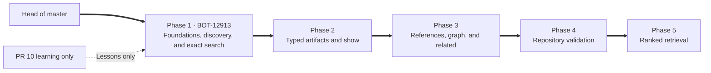
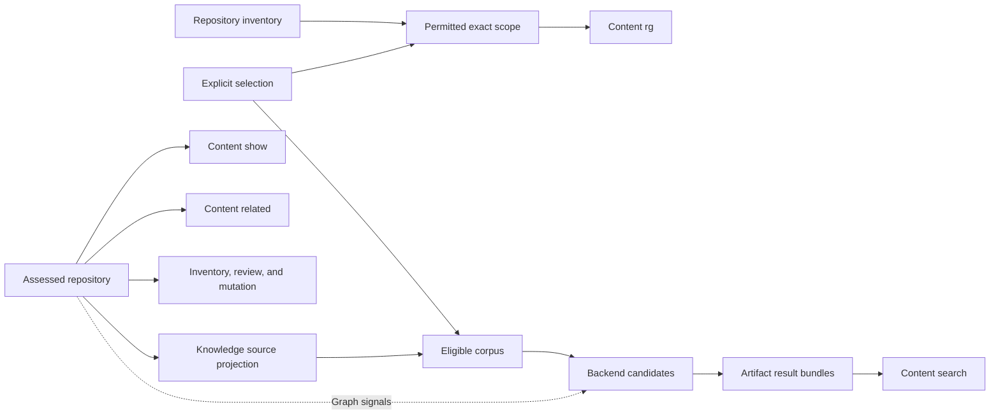

# Flywheel CLI architecture plan

This plan consolidates the decisions from our discussion into one architecture for the five phases tracked by BOT-12912 and the remaining `flywheel` CLI.

It is an architectural contract, not a commitment to exact filenames or TypeScript spellings. PR #10 should be treated as learning material only; implementation should restart from `master`.

## 1. Goals

The architecture should:

- Give every command one consistent interpretation of repository paths, artifacts, targets, references, and relationships.
- Keep commands thin and move reusable behavior behind narrow component boundaries.
- Make parsing, graph construction, validation, retrieval, and rendering independently testable.
- Preserve canonical authored content and provenance.
- Support future commands without requiring new repository scanners or parsers.
- Make future caching and incremental processing insertable without implementing them now.
- Remain simple enough to evolve as the difficult parts become apparent.

It should not initially introduce:

- Persistent caches or indexes
- Cache invalidation machinery
- Content hashes solely for hypothetical caching
- Background indexing or file watchers
- Incremental dependency tracking
- A graph database or graph query language
- Runtime parser or resolver plugins
- A dependency-injection container
- An event bus or generic lifecycle framework
- Backend-specific types in the shared repository model
- Memory retrieval behavior before its governing contract exists
- A separate workspace package before a second package actually needs these components

## 2. Delivery sequence



Phase 1 establishes the repository vocabulary and source boundary used by every later phase. It implements discovery, classification, selection, and exact source search without introducing artifact parsing, graph construction, validation, or ranked retrieval early.

Phase 2 compiles the recognized files into typed artifacts and provides exact artifact lookup. Phase 3 resolves authored references, constructs the relationship graph, and exposes relationship traversal. Phase 4 validates the composed repository model. Phase 5 derives retrieval projections only from an explicit validation assessment.

Each phase should add the smallest complete vertical slice that exercises its new boundaries. Later-phase directories, types, and infrastructure should not be added speculatively.

## 3. Architectural model

The library should behave like a small compiler:

```text
canonical repository
  -> discover files
  -> classify repository entries
  -> parse typed artifacts
  -> extract authored references
  -> resolve typed targets
  -> construct relationships and graph
  -> validate the repository-wide model
  -> derive command-specific projections
```

### Compilation and validation

```mermaid
flowchart LR
    source[/Repository source/]
    discovery["Discovery"]
    inventory["Repository inventory"]
    batchRead["Batch file read"]
    parsers["Artifact parsers"]
    compilations["Artifact compilations"]
    targetIndex["Target lookup"]
    resolution["Reference resolution"]
    repoGraph["Repository graph"]
    projection["Repository projection"]
    validation["Validation report"]
    assessed["Assessed repository"]

    source --> discovery
    discovery --> inventory

    source --> batchRead
    inventory --> batchRead
    batchRead --> parsers
    parsers --> compilations

    compilations --> targetIndex
    compilations --> resolution
    targetIndex --> resolution

    compilations --> repoGraph
    resolution --> repoGraph

    inventory --> projection
    compilations --> projection
    resolution --> projection
    repoGraph --> projection

    projection --> validation
    projection --> assessed
    validation --> assessed
```



The graph is constructed before whole-repository validation because validation may need the graph to find dangling targets, invalid relationships, and global inconsistencies.

The graph may therefore be used internally by validation before it passes validation. Semantic retrieval must receive the validation assessment and must not silently treat an incomplete or invalid projection as trustworthy.

There is no need to duplicate the graph into separate raw and validated graph representations.

### Command composition



The four retrieval intents stay separate:

- `search`: ranked discovery returning source-faithful artifact passage bundles
- `rg`: exact text and structural search over permitted roots
- `show`: substantive inspection of a known Flywheel-owned target
- `related`: typed relationship traversal around a known graph target

They share foundations but do not share result models.

## 4. Core architectural decisions

| Decision                                                        | Rationale                                                                                                                 |
| --------------------------------------------------------------- | ------------------------------------------------------------------------------------------------------------------------- |
| One repository compiler                                         | Prevents validation, search, inspection, and management commands from developing inconsistent repository interpretations. |
| Canonical files own truth                                       | Graphs, indexes, passages, scores, and caches remain rebuildable aids rather than competing authorities.                  |
| Typed artifact union                                            | Each artifact kind has explicit required fields instead of a large optional-property object.                              |
| Central target construction                                     | Prevents different components from inventing incompatible string identifiers.                                             |
| Authored references remain distinct from resolved references    | Preserves source evidence while allowing semantic resolution and useful diagnostics.                                      |
| Graph contains semantic facts only                              | Validation diagnostics, search scores, rendering state, and mutation plans have different lifecycles and owners.          |
| Graph construction precedes validation                          | Whole-repository validation may require the graph itself.                                                                 |
| Retrieval consumes validation                                   | An unchecked or incomplete graph cannot silently become retrieval authority.                                              |
| Eligibility precedes ranking cutoff                             | Excluded content must not displace valid candidates before filtering.                                                     |
| Knowledge projection preserves authored structure               | Search results must preserve headings, procedures, lists, code, tables, citations, and locations.                         |
| Parser ASTs remain private and temporary                        | Prevents parser-specific structures from coupling validation, graph, retrieval, and rendering.                            |
| Canonical outputs are plain values                              | Improves testing and makes future persistence possible without designing it now.                                          |
| In-memory lookup maps are derived accelerators                  | Efficient queries do not require maps to become another source of truth.                                                  |
| Full compilation is orchestration, not the only lower-level API | Future targeted parsing and incremental rebuilding remain possible.                                                       |
| Retrieval backend remains replaceable                           | Lexical, semantic, fusion, and reranking choices must not redefine Flywheel semantics.                                    |
| Commands return structured results before rendering             | Human output, JSON, tests, and future callers can share the same operation.                                               |
| No separate package yet                                         | Directory boundaries provide modularity without premature workspace and release overhead.                                 |

## 5. Architectural invariants

### Authority and provenance

1. Canonical repository files and authored references are authoritative.
2. Derived graphs, indexes, passages, scores, and caches are disposable.
3. Derived state must never silently rewrite or reinterpret authored content.
4. Every relationship retains its authored or structural provenance.
5. External targets may appear as identities and graph neighbors without their live content being fetched.
6. Search results present authored content, not generated summaries presented as source material.

### Repository interpretation

7. Paths are classified once by the repository component.
8. Downstream components do not rediscover repository regions from path strings.
9. Repository selection is explicit input; it is never inferred from ambient Task context.
10. Unsupported and prohibited files remain visible in inventory results.
11. Unparsed artifacts and unresolved references are preserved rather than discarded.

### Parsing and types

12. Each accepted artifact is parsed at most once per projection build.
13. Markdown and YAML parser ASTs never cross artifact-component boundaries.
14. Artifact parsers return normalized plain data, source locations, references, and parsing problems.
15. Artifacts form a discriminated union rather than a bag of optional fields.
16. Target IDs are constructed centrally and deterministically.
17. Parser, search-backend, and renderer implementation types do not leak into shared contracts.

### Graph and validation

18. The graph contains targets, relationships, adjacency, aliases, and provenance.
19. The graph does not contain diagnostics, search scores, display state, mutation plans, or cache metadata.
20. Whole-repository validation consumes the compiled projection and graph.
21. Retrieval receives both the projection and its validation report.
22. Invalid or incomplete state cannot be converted into an apparent successful empty result.
23. The exact fail-versus-partial policy remains explicit and operation-owned.

### Retrieval

24. Ranked search initially admits Docs and Catalog entities, not Roles, Daemons, Skills, support files, source code, Tasks, transcripts, or external identities.
25. Memory is not added until its separate contract defines its mechanics.
26. Repository, lifecycle, and content-type eligibility is applied before candidate cutoff.
27. Backend candidates and public search results are different types.
28. Public search limits count artifacts, not raw passages.
29. Public results group one or more source-faithful passages under an artifact.
30. Only citations used by returned passages are presented.
31. Truncation, omissions, incomplete projections, and backend failures remain visible.
32. `rg` bypasses semantic parsing and ranking and preserves exact-search behavior over permitted roots.
33. `show` accepts inspectable Flywheel targets, not arbitrary external identities.
34. `related` may return external identities without fetching them.

### Evolution and performance

35. Pipeline stages are deterministic and independently callable.
36. Repository enumeration and content reading are batch-oriented.
37. Target and alias indexes are built before reference resolution.
38. Graph adjacency is built once rather than reconstructed per traversal.
39. Consumers do not reread or reparse canonical files when the projection already contains the required information.
40. Caching must be insertable but is explicitly not an initial deliverable.
41. No cache-specific metadata is added until an implemented optimization requires it.
42. Timing-sensitive optimization follows measurement; structural performance problems are prevented immediately.

## 6. Illustrative boundary types

These types show ownership and dependency direction. Exact field names can evolve with the governing artifact work.

### Repository source and inventory

```ts
export type RepositoryPath = string;
export type RepositoryId = `${string}/${string}`;

export type RepositoryState =
  | { readonly kind: 'working-tree' }
  | { readonly kind: 'index' }
  | { readonly kind: 'commit'; readonly revision: string };

export interface SourceLocation {
  readonly path: RepositoryPath;
  readonly start: {
    readonly line: number;
    readonly column: number;
  };
  readonly end?: {
    readonly line: number;
    readonly column: number;
  };
}

export interface RepositoryFile {
  readonly path: RepositoryPath;
  readonly mode: number;
}

export type FileReadResult =
  | {
      readonly kind: 'read';
      readonly path: RepositoryPath;
      readonly bytes: Uint8Array;
    }
  | {
      readonly kind: 'missing';
      readonly path: RepositoryPath;
    };

export interface RepositorySource {
  readonly state: RepositoryState;

  listFiles(): Promise<readonly RepositoryFile[]>;

  readFiles(
    paths: readonly RepositoryPath[]
  ): Promise<readonly FileReadResult[]>;
}
```

The source boundary is deliberately batch-oriented. Working-tree, exact-index, and commit implementations can share it without exposing Git mechanics downstream.

```ts
export type RepositoryRegion =
  | { readonly kind: 'core' }
  | { readonly kind: 'customer-wide' }
  | {
      readonly kind: 'repository-specific';
      readonly repository: RepositoryId;
    }
  | { readonly kind: 'roles' }
  | { readonly kind: 'flywheel-state' };

export type RepositorySelection =
  | { readonly kind: 'customer-wide-only' }
  | { readonly kind: 'customer-wide-and-all-repositories' }
  | {
      readonly kind: 'customer-wide-and-repositories';
      readonly repositories: readonly RepositoryId[];
    };

export type ArtifactKind = 'document' | 'catalog' | 'role' | 'daemon' | 'skill';

export type RepositoryEntry =
  | {
      readonly kind: 'artifact';
      readonly path: RepositoryPath;
      readonly region: RepositoryRegion;
      readonly artifactKind: ArtifactKind;
    }
  | {
      readonly kind: 'support-file';
      readonly path: RepositoryPath;
      readonly region: RepositoryRegion;
      readonly owner: RepositoryPath;
    }
  | {
      readonly kind: 'tooling-state';
      readonly path: RepositoryPath;
    }
  | {
      readonly kind: 'prohibited';
      readonly path: RepositoryPath;
      readonly rule: string;
    }
  | {
      readonly kind: 'unsupported';
      readonly path: RepositoryPath;
    };

export interface RepositoryInventory {
  readonly entries: readonly RepositoryEntry[];
  readonly repositories: readonly RepositoryId[];
}
```

Lookup maps such as `entryByPath` can be derived in memory. They need not be embedded as the canonical representation.

### Targets and identity

```ts
export interface DocumentTarget {
  readonly kind: 'document';
  readonly path: RepositoryPath;
}

export interface DocumentSectionTarget {
  readonly kind: 'document-section';
  readonly document: DocumentTarget;
  readonly anchor: string;
}

export interface CatalogTarget {
  readonly kind: 'catalog';
  readonly entityKind: string;
  readonly namespace: string;
  readonly name: string;
}

export interface RoleTarget {
  readonly kind: 'role';
  readonly name: string;
}

export interface DaemonTarget {
  readonly kind: 'daemon';
  readonly name: string;
}

export interface SkillTarget {
  readonly kind: 'skill';
  readonly name: string;
}

export interface SupportResourceTarget {
  readonly kind: 'support-resource';
  readonly path: RepositoryPath;
  readonly owner: TargetId;
}

export type InspectableTarget =
  | DocumentTarget
  | DocumentSectionTarget
  | CatalogTarget
  | RoleTarget
  | DaemonTarget
  | SkillTarget;

export type ExternalIdentityTarget =
  | {
      readonly kind: 'github';
      readonly repository: string;
      readonly resource: 'issue' | 'pull-request' | 'commit';
      readonly identifier: string;
    }
  | {
      readonly kind: 'linear';
      readonly issueId: string;
    }
  | {
      readonly kind: 'slack';
      readonly channelId: string;
      readonly messageTs?: string;
    }
  | {
      readonly kind: 'task';
      readonly taskId: string;
    }
  | {
      readonly kind: 'transcript-item';
      readonly taskId: string;
      readonly itemId: string;
    }
  | {
      readonly kind: 'source-repository-file';
      readonly repository: RepositoryId;
      readonly path: string;
    }
  | {
      readonly kind: 'web';
      readonly url: string;
    };

export type GraphTarget =
  InspectableTarget | SupportResourceTarget | ExternalIdentityTarget;

export type TargetId = string;

export function targetId(target: GraphTarget): TargetId;
```

Commands accept narrower target families. The existence of a target in `GraphTarget` does not imply that `show` can fetch it.

### References and relationships

```ts
export type RelationshipKind =
  | 'contains'
  | 'declares'
  | 'part-of'
  | 'about'
  | 'cites'
  | 'links-to'
  | 'mentions'
  | 'owned-by'
  | 'member-of'
  | 'depends-on'
  | 'documents'
  | 'provides-api'
  | 'consumes-api'
  | 'supersedes'
  | 'contributes-to'
  | 'uses'
  | 'applies-to'
  | 'represents'
  | 'reviewed-by';

export interface AuthoredReference {
  readonly raw: string;
  readonly relationship: RelationshipKind;
  readonly source: SourceLocation;
  readonly label?: string;
  readonly citationKey?: string;
}

export type ReferenceResolution =
  | {
      readonly kind: 'resolved';
      readonly authored: AuthoredReference;
      readonly target: GraphTarget;
    }
  | {
      readonly kind: 'unresolved';
      readonly authored: AuthoredReference;
      readonly reason:
        | 'invalid-syntax'
        | 'unknown-target'
        | 'ambiguous-target'
        | 'unsupported-target';
      readonly candidates?: readonly GraphTarget[];
    };
```

Resolution is offline. External references become typed identities; resolving them does not fetch provider content.

### Typed artifacts and normalized document structure

```ts
export interface KnowledgeLifecycle {
  readonly status: string;
  readonly active: boolean;
}

export type SourceFragment =
  | {
      readonly kind: 'prose';
      readonly text: string;
      readonly source: SourceLocation;
      readonly citationKeys: readonly string[];
    }
  | {
      readonly kind: 'list';
      readonly ordered: boolean;
      readonly items: readonly string[];
      readonly source: SourceLocation;
      readonly citationKeys: readonly string[];
    }
  | {
      readonly kind: 'code';
      readonly language?: string;
      readonly code: string;
      readonly source: SourceLocation;
    }
  | {
      readonly kind: 'table';
      readonly rows: readonly (readonly string[])[];
      readonly source: SourceLocation;
      readonly citationKeys: readonly string[];
    };

export interface DocumentSection {
  readonly target: DocumentSectionTarget;
  readonly headingPath: readonly string[];
  readonly source: SourceLocation;
  readonly fragments: readonly SourceFragment[];
}

export interface CitationDefinition {
  readonly key: string;
  readonly target: GraphTarget;
  readonly source: SourceLocation;
}

interface ArtifactBase<
  Kind extends ArtifactKind,
  Target extends InspectableTarget,
> {
  readonly kind: Kind;
  readonly target: Target;
  readonly path: RepositoryPath;
  readonly region: RepositoryRegion;
  readonly source: SourceLocation;
  readonly authoredReferences: readonly AuthoredReference[];
}

export interface DocumentArtifact extends ArtifactBase<
  'document',
  DocumentTarget
> {
  readonly title: string;
  readonly purpose: string;
  readonly lifecycle: KnowledgeLifecycle;
  readonly sections: readonly DocumentSection[];
  readonly citations: readonly CitationDefinition[];
}

export interface CatalogArtifact extends ArtifactBase<
  'catalog',
  CatalogTarget
> {
  readonly lifecycle: KnowledgeLifecycle;
  readonly description?: string;
  readonly fields: readonly {
    readonly name: string;
    readonly value: string;
    readonly source: SourceLocation;
  }[];
}

export interface RoleArtifact extends ArtifactBase<'role', RoleTarget> {
  readonly objective: string;
  readonly daemons: readonly DaemonTarget[];
  readonly skills: readonly SkillTarget[];
}

export interface DaemonArtifact extends ArtifactBase<'daemon', DaemonTarget> {
  readonly purpose: string;
  readonly role?: RoleTarget;
  readonly activation: DaemonActivation;
}

export interface SkillArtifact extends ArtifactBase<'skill', SkillTarget> {
  readonly name: string;
  readonly description: string;
}

export type FlywheelArtifact =
  | DocumentArtifact
  | CatalogArtifact
  | RoleArtifact
  | DaemonArtifact
  | SkillArtifact;
```

`DaemonActivation` represents the prerequisite-owned Daemon contract and is intentionally not invented here.

`SourceFragment` is a retrieval-oriented normalization example, not a proposal to recreate a universal Markdown AST. It preserves only structure Flywheel needs.

```ts
export interface ArtifactProblem {
  readonly code: string;
  readonly message: string;
  readonly source: SourceLocation;
}

export type ArtifactCompilation =
  | {
      readonly kind: 'parsed';
      readonly entry: Extract<RepositoryEntry, { readonly kind: 'artifact' }>;
      readonly artifacts: readonly FlywheelArtifact[];
      readonly problems: readonly ArtifactProblem[];
    }
  | {
      readonly kind: 'unparsed';
      readonly entry: Extract<RepositoryEntry, { readonly kind: 'artifact' }>;
      readonly problems: readonly ArtifactProblem[];
    };
```

A parsed artifact can have problems and still participate in compilation. Validation decides their significance.

### Graph, projection, and assessment

```ts
export interface GraphTargetRecord {
  readonly id: TargetId;
  readonly target: GraphTarget;
}

export type RelationshipProvenance =
  | {
      readonly kind: 'authored';
      readonly reference: AuthoredReference;
    }
  | {
      readonly kind: 'structural';
      readonly source: SourceLocation;
      readonly rule: string;
    };

export interface Relationship {
  readonly from: TargetId;
  readonly to: TargetId;
  readonly kind: RelationshipKind;
  readonly provenance: RelationshipProvenance;
}

export interface RepositoryGraph {
  readonly targets: readonly GraphTargetRecord[];
  readonly relationships: readonly Relationship[];
}

export interface RepositoryGraphIndex {
  readonly targetById: ReadonlyMap<TargetId, GraphTarget>;
  readonly outgoingByTarget: ReadonlyMap<TargetId, readonly Relationship[]>;
  readonly incomingByTarget: ReadonlyMap<TargetId, readonly Relationship[]>;
}

export interface RepositoryProjection {
  readonly source: RepositoryState;
  readonly inventory: RepositoryInventory;
  readonly compilations: readonly ArtifactCompilation[];
  readonly resolutions: readonly ReferenceResolution[];
  readonly graph: RepositoryGraph;
}

export interface RepositoryIndexes {
  readonly artifactByTarget: ReadonlyMap<TargetId, FlywheelArtifact>;
  readonly artifactsByPath: ReadonlyMap<
    RepositoryPath,
    readonly FlywheelArtifact[]
  >;
  readonly aliases: ReadonlyMap<string, TargetId>;
  readonly graph: RepositoryGraphIndex;
}
```

`RepositoryProjection` is canonical plain data for the compiled snapshot. `RepositoryIndexes` is an in-memory acceleration structure derived from it.

```ts
export interface ValidationDiagnostic {
  readonly code: string;
  readonly severity: 'error' | 'warning';
  readonly message: string;
  readonly source?: SourceLocation;
  readonly target?: TargetId;
}

export interface ValidationReport {
  readonly status: 'valid' | 'invalid' | 'incomplete';
  readonly diagnostics: readonly ValidationDiagnostic[];
}

export interface AssessedRepository {
  readonly projection: RepositoryProjection;
  readonly validation: ValidationReport;
}
```

The assessment does not copy or mutate the graph. It associates the validation result with the exact compiled projection used by retrieval.

### Retrieval corpus and eligibility

```ts
export type KnowledgeContentType = 'document' | 'catalog';

export type LifecycleSelection =
  { readonly kind: 'active-only' } | { readonly kind: 'include-non-active' };

export interface RetrievalScope {
  readonly repositories: RepositorySelection;
  readonly lifecycle: LifecycleSelection;
  readonly contentTypes: readonly KnowledgeContentType[];
}

export interface KnowledgeSourceUnit {
  readonly id: string;
  readonly artifact: TargetId;
  readonly section?: TargetId;
  readonly source: SourceLocation;
  readonly authoredText: string;
  readonly structuralKind:
    'prose' | 'list' | 'code' | 'table' | 'catalog-field';
  readonly headingPath: readonly string[];
  readonly citationKeys: readonly string[];
}

export interface KnowledgeSourceProjection {
  readonly artifacts: readonly (DocumentArtifact | CatalogArtifact)[];
  readonly units: readonly KnowledgeSourceUnit[];
  readonly citations: readonly CitationDefinition[];
}

export interface EligibleKnowledgeCorpus {
  readonly scope: RetrievalScope;
  readonly artifactIds: readonly TargetId[];
  readonly unitIds: readonly string[];
}
```

The source projection may include retained inactive Knowledge. `EligibleKnowledgeCorpus` applies the particular request’s repository, lifecycle, and type selection before ranking.

Memory is deliberately absent.

### Backend candidates and public results

```ts
export interface PassageCandidate {
  readonly unitId: string;
  readonly artifact: TargetId;
  readonly score: number;
}

export interface CandidateRequest {
  readonly query: string;
  readonly source: KnowledgeSourceProjection;
  readonly corpus: EligibleKnowledgeCorpus;
}

export interface RetrievalCandidateSource {
  findCandidates(
    request: CandidateRequest
  ): Promise<readonly PassageCandidate[]>;
}
```

`PassageCandidate` is internal. Scores and backend mechanics do not cross into public Flywheel results.

```ts
export interface SearchPassage {
  readonly source: SourceLocation;
  readonly headingPath: readonly string[];
  readonly authoredText: string;
  readonly omittedBefore: boolean;
  readonly omittedAfter: boolean;
}

export interface ArtifactSearchResult {
  readonly artifact: InspectableTarget;
  readonly title: string;
  readonly passages: readonly SearchPassage[];
  readonly citations: readonly CitationDefinition[];
}

export interface SearchContext {
  readonly repositorySelection: RepositorySelection;
  readonly lifecycleSelection: LifecycleSelection;
  readonly contentTypes: readonly KnowledgeContentType[];
}

export type SearchNotice =
  | { readonly kind: 'inactive-content-excluded' }
  | { readonly kind: 'response-shortened' }
  | {
      readonly kind: 'projection-incomplete';
      readonly diagnostics: readonly ValidationDiagnostic[];
    };

export type SearchOutcome =
  | {
      readonly kind: 'results';
      readonly context: SearchContext;
      readonly results: readonly ArtifactSearchResult[];
      readonly notices: readonly SearchNotice[];
    }
  | {
      readonly kind: 'no-eligible-content';
      readonly context: SearchContext;
    }
  | {
      readonly kind: 'no-useful-result';
      readonly context: SearchContext;
    }
  | {
      readonly kind: 'invalid-selection';
      readonly message: string;
    }
  | {
      readonly kind: 'unavailable';
      readonly reason:
        | 'repository-unavailable'
        | 'projection-incomplete'
        | 'backend-unavailable';
      readonly diagnostics: readonly ValidationDiagnostic[];
    }
  | {
      readonly kind: 'unsupported';
      readonly operation: string;
    };
```

The exact fail-versus-partial policy is still open, but the result model must be capable of expressing the required distinctions.

### Top-level orchestration

```ts
export async function compileRepository(
  source: RepositorySource
): Promise<RepositoryProjection>;

export function buildRepositoryIndexes(
  projection: RepositoryProjection
): RepositoryIndexes;

export function validateRepository(
  projection: RepositoryProjection,
  indexes: RepositoryIndexes
): ValidationReport;

export function assessRepository(
  projection: RepositoryProjection,
  validation: ValidationReport
): AssessedRepository;

export function projectKnowledge(
  repository: AssessedRepository
): KnowledgeSourceProjection;

export function selectEligibleKnowledge(
  source: KnowledgeSourceProjection,
  scope: RetrievalScope
): EligibleKnowledgeCorpus;
```

These are orchestration functions over smaller component functions. They should not become the only available way to parse a batch of artifacts or build a graph from supplied values.

## 7. Performance-sensitive boundaries

| Work                  | Correct location           | Initial requirement               | Future insertion point                         |
| --------------------- | -------------------------- | --------------------------------- | ---------------------------------------------- |
| Repository traversal  | `RepositorySource`         | One listing and batch reads       | Faster Git adapter or repository-state reuse   |
| Markdown/YAML parsing | Artifact parser            | Parse once; AST remains temporary | Per-file memoization or worker execution       |
| Target indexing       | Target component           | Build once before resolution      | Persisted or incremental target lookup         |
| Reference resolution  | Reference component        | Lookup-based resolution           | Re-resolve changed artifacts                   |
| Graph adjacency       | Graph component            | Build once per projection         | Persisted or incrementally updated graph index |
| Validation            | Validation component       | Consume normalized projection     | Incremental rule evaluation                    |
| Passage construction  | Retrieval corpus component | Reuse parsed structure            | Persisted source-unit projection               |
| Embeddings/indexing   | Backend adapter            | Rebuild directly at first         | Persistent or remote backend index             |
| Ranking               | Backend adapter            | Replaceable implementation        | Fusion, reranking, graph signals               |
| Rendering             | Flywheel result assembly   | No rereads or reparsing           | Alternative output renderers                   |

The most important parsing rule is:

```text
file bytes
  -> one parser invocation
  -> temporary AST
  -> artifact + references + source structure + problems
  -> discard AST
```

No validator, graph builder, search implementation, or renderer should parse Markdown again.

## 8. Caching and incremental work

The explicit initial requirement is:

> Caching must be insertable, but cache infrastructure is out of scope.

The architecture supports later caching through deterministic functions and plain-data boundaries. It does not implement hypothetical cache state.

Do now:

- Keep transformation inputs and outputs explicit.
- Preserve deterministic identity and ordering.
- Keep stages independently callable.
- Use batch APIs.
- Keep backend projections separated from canonical models.
- Allow parsers to operate on arbitrary batches, not only an entire repository.

Do not do now:

- Add a `Cache` interface.
- Calculate unused file hashes.
- Track projection generations.
- Define serialization formats.
- Add invalidation callbacks.
- Track changed dependency sets.
- Start background processes.
- Persist graph or parser outputs.
- Add cache-specific telemetry.
- Introduce worker scheduling.

When measurements identify a bottleneck, persistence or incremental work can wrap the responsible stage without altering downstream semantic contracts.

## 9. Proposed directory structure

This preserves the existing `src/cli` and `src/lib` split while replacing the monolithic `lib/content` implementation with component-owned boundaries.

```text
clis/flywheel/
  bin/
    run.ts

  src/
    cli/
      commands/
        content/
          search.ts
          rg.ts
          show.ts
          related.ts
          validate.ts
        role/
        daemon/
        skill/
        review/
        setup/
        git/

      output/
        search.ts
        show.ts
        related.ts
        diagnostics.ts

      utils/
        runtime.ts
        content-flags.ts

      __tests__/
        help.test.ts
        invocation.test.ts
        output.test.ts
        readonly.test.ts

    lib/
      repository/
        contract.ts
        discover.ts
        selection.ts
        indexes.ts
        index.ts

        source/
          contract.ts
          working-tree.ts
          git-index.ts
          commit.ts

        __tests__/
          discovery.test.ts
          selection.test.ts
          source-contract.test.ts

      targets/
        contract.ts
        id.ts
        lookup.ts
        index.ts

        __tests__/
          id.test.ts
          lookup.test.ts

      references/
        contract.ts
        extract.ts
        resolve.ts
        index.ts

        __tests__/
          extraction.test.ts
          resolution.test.ts

      artifacts/
        contract.ts
        parse.ts
        index.ts

        document/
          contract.ts
          parse.ts
          normalize.ts
          __tests__/
            parse.test.ts
            structure.test.ts
            citations.test.ts
            fixtures/

        catalog/
          contract.ts
          parse.ts
          __tests__/
            parse.test.ts
            fixtures/

        role/
          contract.ts
          parse.ts
          __tests__/
            parse.test.ts
            fixtures/

        daemon/
          contract.ts
          parse.ts
          __tests__/
            parse.test.ts
            fixtures/

        skill/
          contract.ts
          parse.ts
          __tests__/
            parse.test.ts
            fixtures/

      graph/
        contract.ts
        build.ts
        indexes.ts
        query.ts
        index.ts

        __tests__/
          build.test.ts
          provenance.test.ts
          query.test.ts

      projection/
        contract.ts
        compile.ts
        indexes.ts
        index.ts

        __tests__/
          compile.test.ts
          determinism.test.ts
          performance-boundaries.test.ts
          fixtures/

      validation/
        contract.ts
        validate.ts
        rules/
        index.ts

        __tests__/
          artifact-validation.test.ts
          repository-validation.test.ts
          incomplete-projection.test.ts
          fixtures/

      retrieval/
        contract.ts
        index.ts

        corpus/
          project.ts
          eligibility.ts
          source-units.ts
          __tests__/
            projection.test.ts
            eligibility.test.ts

        search/
          candidate-source.ts
          group-results.ts
          search.ts
          __tests__/
            grouping.test.ts
            failures.test.ts
            source-fidelity.test.ts

        exact/
          plan.ts
          execute.ts
          __tests__/
            scope.test.ts
            behavior.test.ts

        show/
          show.ts
          __tests__/
            show.test.ts

        related/
          related.ts
          __tests__/
            related.test.ts

      presets/
        ...

  presets/
    ...
```

Not every future directory should be created during Phase 1. The tree shows intended ownership as functionality arrives.

Directory rules:

- `contract.ts` contains the public component boundary.
- Component-local parsing and helper types remain inside the component.
- Each component exports intentionally through its `index.ts`.
- Consumers import public contracts, not another component’s internal helpers.
- There is no global `shared/types.ts`.
- A new directory is added when it represents a real independently changing component, not merely to hold one trivial helper.
- `git-index.ts`, `commit.ts`, validation, and retrieval files arrive with the work that needs them.
- No `cache/`, `plugins/`, `registry/`, or `lifecycle/` directory is created speculatively.

## 10. Dependency direction

The intended import direction is:

```text
repository primitives
  -> targets and authored-reference contracts
  -> artifact contracts and parsers
  -> reference resolution
  -> graph
  -> repository projection
  -> validation
  -> retrieval and management capabilities
  -> CLI commands and renderers
```

Specific rules:

- Repository code imports no artifact, graph, validation, retrieval, or CLI code.
- Artifact parsers may import repository, target, and authored-reference contracts.
- Reference resolution may consume artifacts and target lookups.
- Graph construction consumes targets, artifacts, and reference resolutions.
- Validation consumes the repository projection; the projection does not import validation.
- Retrieval consumes the projection and validation report; neither imports retrieval.
- CLI modules may compose library capabilities but must not contain repository semantics.
- Rendering is the final boundary and does not feed data back into the model.

## 11. Testing strategy

### Component tests

Each component receives focused tests for its public contract:

- Repository path classification and selection
- Source-adapter contract behavior
- Artifact parsing and normalization
- Source locations and citation extraction
- Stable target IDs
- Reference resolution routes and ambiguity
- Graph edge construction and provenance
- Incoming and outgoing traversal
- Validation rules
- Retrieval eligibility and grouping
- Failure and truncation outcomes

### Shared-boundary tests

Boundary tests should prove:

- Every artifact target can be indexed and resolved.
- Every resolved reference can become a graph edge.
- Every graph edge retains provenance.
- Every inspectable target maps to its owning artifact.
- External identities cannot be fetched through `show`.
- Repository selection cannot escape permitted roots.
- Retrieval cannot admit an excluded artifact.
- Ineligible backend candidates cannot displace eligible ones.
- Search limits count grouped artifacts rather than passages.
- Invalid and incomplete states cannot look like successful empty results.

### Structural performance tests

Initial performance tests should verify behavior rather than wall-clock timing:

- Repository files are listed once.
- Artifact contents are read in batches.
- Each artifact parser is invoked once per projection build.
- Validators do not read or parse files.
- `related` uses adjacency indexes rather than scanning every relationship.
- Search result assembly does not reread source files.
- Exact search does not invoke semantic parsers.
- One command does not spawn one Git process per artifact.

Wall-clock benchmarks should be added only when there is a representative corpus and an actual performance question.

### Composition tests

A small number of end-to-end fixtures should prove the complete pipeline:

```text
repository fixture
  -> inventory
  -> artifacts
  -> references
  -> graph
  -> validation
  -> retrieval or management result
```

CLI tests should focus on argument handling, exit behavior, and rendering rather than retesting library semantics through every command.

## 12. Phase acceptance criteria

### Phase 1: foundations, discovery, and exact search

Phase 1 is complete when it provides:

- Narrow public contracts for repository paths, states, regions, identities, selections, entries, inventories, and batch-capable source access
- A working-tree source implementation with deterministic listing and batch reads
- Discovery of core, customer-wide, repository-specific, Roles, and `.flywheel` regions
- Normalized repository identities derived from repository-specific paths
- Explicit classification of artifacts, artifact support, Flywheel tooling state, prohibited content, and unsupported content
- Exact `content rg` scope derived from the repository inventory and explicit selection
- Charlie-relative output, repository-boundary enforcement, and the specified CLI delimiter and exit behavior
- Durable architecture documentation plus focused component, boundary, and CLI tests

It does not provide artifact parsing, reference resolution, graph construction, validation, ranked retrieval, persistent indexes, caches, alternate source adapters, or mutation machinery.

### Phase 2: typed artifacts and show

Phase 2 is complete when it provides:

- Typed Docs, Catalog, Role, Daemon, and Skill artifact contracts
- Parser components that keep syntax-tree and parser-library types private
- Batch reading and parse-once compilation from the repository inventory
- Canonical artifact identities, source locations, authored content, and artifact-local parse diagnostics
- Exact artifact lookup and `show` behavior over compiled artifacts
- Visible unparsed material and deterministic component outputs

### Phase 3: references, graph, and related

Phase 3 is complete when it provides:

- Authored and resolved reference representation
- Typed target construction and deterministic lookup
- Reference resolution with unresolved references retained
- Deterministic graph construction with relationship provenance
- Replaceable target and adjacency indexes derived from canonical graph values
- A plain-data repository projection
- `related` behavior over the graph rather than source-text heuristics

### Phase 4: repository validation

Phase 4 is complete when it provides:

- Whole-repository validation over the projection
- Artifact-local and graph-wide diagnostics
- Valid, invalid, and incomplete assessment
- Visible unresolved, unsupported, prohibited, and unparsed material
- A report consumable by retrieval and mutation commands
- Proof that validation does not reread or reparse repository files

### Phase 5: ranked retrieval

Phase 5 is complete when it provides:

- Backend-independent Doc and Catalog source projection
- Explicit repository, lifecycle, and content-type eligibility
- Eligibility before candidate cutoff
- Replaceable candidate-source boundary
- Artifact-grouped passage results
- Source fidelity, locations, citations, and omission markers
- Distinct failure and no-result outcomes
- Separate `search`, `rg`, `show`, and `related` behavior

It does not initially provide:

- Memory participation
- Automatic Task-context selection
- Persistent semantic indexes unless measurement requires them
- Settled ranking models or fusion weights
- Settled output budgets or traversal depth beyond their governing contracts

## 13. Intentionally open decisions

The architecture leaves these open without blocking Phase 1:

- Search provider and ranking strategy
- Lexical versus semantic retrieval composition
- Embedding models and storage
- Persistent index and invalidation design
- Output and passage budgets
- Default result count
- `show` depth and metadata controls
- `related` depth, filtering, ordering, and external-target input
- Machine-readable retrieval output
- Partial-versus-failed retrieval policy for particular validation problems
- Memory artifacts and retrieval behavior
- Automatic context assembly
- When measured performance warrants caching or incremental rebuilding
- Whether a genuine second consumer eventually justifies extracting a workspace package

The central design principle is:

> Compile the repository once into a lossless typed semantic model; validate that model before relying on it; derive narrow command projections from it; and keep every derived optimization replaceable and non-authoritative.
